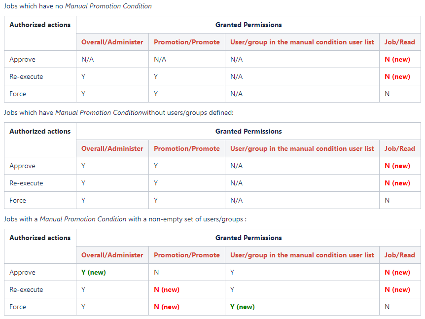

## Changelog

##### Version 3.3 and newer releases

See [GitHub Releases](https://github.com/jenkinsci/promoted-builds-plugin/releases)

##### Version 3.2 (JUN 4, 2018)

-   [PR #116](https://github.com/jenkinsci/promoted-builds-plugin/pull/116)
    -  Show the full display name of runs in promoted build parameters

##### Version 3.1 (Mar 12, 2018)

-   [JENKINS-40803](https://issues.jenkins-ci.org/browse/JENKINS-40803) - Prevent
    infinite loop while promoting a build when the Config File Provider Plugin is installed.

##### Version 3.0 (Feb 26, 2018)

-   ")    [SECURITY-746](https://jenkins.io/security/advisory/2018-02-26/#SECURITY-746) -
    Make permissions consistent for _Approve_, _Re-Execute_, and _Force_ promotion actions
    -   Users with just the Promotion/Promote permission are no longer
        allowed to re-execute or force promotions with a manual
        condition that specifies a list of users, unless the user is on
        that list
    -   Users specified in a manual promotion condition are now allowed
        to force this promotion

    -   Administrators are now able to approve any promotion with a
        manual condition

Compatibility Notes:

-   This change alters the behavior of the Plugin in some conditions, jobs may require reconfiguration.
-   Table below shows the permission changes.
    Legend:
    -   Cells with bold red text - indicate combinations, which revoke dangerous permissions
    -   (manual condition) - Action

##### Version 2.31.1 (Feb 13, 2018)

-   [")
    ](https://issues.jenkins-ci.org/browse/JENKINS-47573) [JENKINS-49433](https://issues.jenkins-ci.org/browse/JENKINS-49433) -
    Prevent NullPointerException in JobDSL when omitting
    the `evenIfUnstable` argument
    -   Affected JobDSL
        methods: `selfPromotion()`, `parameterizedSelfPromotion()`, `downstream()`
-   [")
    ](https://issues.jenkins-ci.org/browse/JENKINS-47573) [JENKINS-48634](https://issues.jenkins-ci.org/browse/JENKINS-48634) -
    Prevent ClassCastException when running promotion from a status page
    with empty forms

##### Version 2.31 (Oct 23, 2017)

-   [")
     JENKINS-47573](https://issues.jenkins-ci.org/browse/JENKINS-47573) -
    Prevent the extension loading issue when the [Rebuild Plugin](https://plugins.jenkins.io/rebuild)
    is not installed (regression in 2.30)

##### Version 2.30 (Oct 19, 2017)

-   [")
    ](https://issues.jenkins-ci.org/browse/JENKINS-37368) [PR
    \#106](https://github.com/jenkinsci/promoted-builds-plugin/pull/106) -
    Update Jenkins core requirement to 1.625.3
-   [")
    ](https://issues.jenkins-ci.org/browse/JENKINS-37368) [PR
    \#106](https://github.com/jenkinsci/promoted-builds-plugin/pull/106) -
    Update Maven plugin requirement to 3.0 and cleanup issues in library
    dependency conflicts
-   ")
    [JENKINS-22068](https://issues.jenkins-ci.org/browse/JENKINS-22068) -
    Fail promotion builds instead of hanging when a promotion is built/rebuilt directly

##### Version 2.29.1 (Sep 7, 2017)

-   [")
     JENKINS-37368](https://issues.jenkins-ci.org/browse/JENKINS-37368) -
    Improve performance of DownstreamPass promotion condition listener logic

##### Version 2.29 (Jun 16, 2017)

-   ")
     [PR #103](https://github.com/jenkinsci/promoted-builds-plugin/pull/103) -
    Update the target core baseline to 1.609.3 
-   ")
     [JENKINS-29586](https://issues.jenkins-ci.org/browse/JENKINS-29586)
    - Add support for ANSI color output in console
-   [PR #102](https://github.com/jenkinsci/promoted-builds-plugin/pull/102) -
    Fix link to the Fingerprint Wiki Page

##### Version 2.28.1 (Jan 31, 2017)

-   ")
    [JENKINS-40552](https://issues.jenkins-ci.org/browse/JENKINS-40552) -
    Prevent possible deadlock between JobPropertyImpl and
    PromotionProcess

##### Version 2.28 (Nov 18, 2016)

-   ")
    [JENKINS-29358](https://issues.jenkins-ci.org/browse/JENKINS-29358) -
    Fix the sort order of the Promotion History
-   ")
    [JENKINS-36623](https://issues.jenkins-ci.org/browse/JENKINS-36623) -
    Fix test runs against the 1.651.3 core (Plugin compatibility tester)
-   ")
    [JENKINS-39362](https://issues.jenkins-ci.org/browse/JENKINS-39362) -
    Fix the binary compatibility issues in test runs by getting rid of `mockito-all`

##### Version 2.27 (May 25th, 2016)

-   ")
    [JENKINS-34826](https://issues.jenkins-ci.org/browse/JENKINS-34826) -
    Make the plugin compatible with
    [SECURITY-170](https://wiki.jenkins-ci.org/display/SECURITY/Jenkins+Security+Advisory+2016-05-11)
    fix in Jenkins 1.651.2+ and 2.3+
-   ")
     [PR #91](https://github.com/jenkinsci/promoted-builds-plugin/pull/91) -
    Prevent exceptions on startup if the optional JobDSL plugin is
    missing
-   ")
     [PR #90](https://github.com/jenkinsci/promoted-builds-plugin/pull/90) -
    Improve the workspace allocation performance

##### Version 2.26 (May 9th, 2016)

-   ")
    [JENKINS-29776](https://issues.jenkins-ci.org/browse/JENKINS-29776) -
    Add Job DSL support for Promoted Builds Plugin
-   ")
    [JENKINS-33147](https://issues.jenkins-ci.org/browse/JENKINS-33147) -
    PROMOTED\_TIMESTAMP used to show the UTC timestamp instead of the local JVM one. 
    Behavior is configurable now
-   ")
     [PR #76](https://github.com/jenkinsci/promoted-builds-plugin/pull/76) -
    Allow hiding promotion processes based on a parameter value
-   ")
     [PR
    \#89](https://github.com/jenkinsci/promoted-builds-plugin/pull/89) -
    Migration to the new Jenkins Plugin parent POM
-   ")
     [PR
    \#87](https://github.com/jenkinsci/promoted-builds-plugin/pull/87) -
    Fixes of minor issues discovered by FindBugs
-   ")
    [JENKINS-34204](https://issues.jenkins-ci.org/browse/JENKINS-34204) -
    Fix minor issues in Job DSL support discovered during the local snapshot testing (not a regression)

##### Version 2.25 (Feb 19th, 2016)

-   ")
    [JENKINS-32993](https://issues.jenkins-ci.org/browse/JENKINS-32993) -
    Expose the PROMOTED\_TIMESTAMP variable in promotion processes
-   ")
     [PR
    \#75](https://github.com/jenkinsci/promoted-builds-plugin/pull/75) -
    Add support for running promotions on inheritance projects
-   ")
    [JENKINS-31908](https://issues.jenkins-ci.org/browse/JENKINS-31908) -
    Sort Promotions in UI by Number instead of customization ID
-   ")
    [JENKINS-31406](https://issues.jenkins-ci.org/browse/JENKINS-31406) -
    Broken layout of promotion status pages in 1.625+

##### Version 2.24.1 (Dec 17th, 2015)

-   ")
    [JENKINS-32006](https://issues.jenkins-ci.org/browse/JENKINS-32006) -
    Revert the erroneous fix of
    [JENKINS-13751](https://issues.jenkins-ci.org/browse/JENKINS-13751)
    in 2.24

##### Version 2.24 (Nov 25th, 2015)

-   ")
    [JENKINS-13751](https://issues.jenkins-ci.org/browse/JENKINS-13751) -
    Promotion process should provide the project\'s SCM to promotion
    steps (**reverted in 2.24.1**)
-   ")
    [JENKINS-31356](https://issues.jenkins-ci.org/browse/JENKINS-31356) -
    The plugin should consider approvers in the re-execution action
-   ")
     [PR
    \#72](https://github.com/jenkinsci/promoted-builds-plugin/pull/72) -
    Fix exception if somebody calls
    PromotionProcess::isFingerprintConfigured()
-   ")
    [JENKINS-29793](https://issues.jenkins-ci.org/browse/JENKINS-29793) -
    Provide parameters from manual approval on all promotions
-   ")
    [JENKINS-27716](https://issues.jenkins-ci.org/browse/JENKINS-27716) -
    Support disabling the promotion jobs in jenkins-1.585+

##### Version 2.23.1 (Nov 2nd, 2015)

-   ")
    [JENKINS-31320](https://issues.jenkins-ci.org/browse/JENKINS-31320) -
    Make the plugin compatible with breaking UI changes in Jenkins 1.619+

##### Version 2.23 (Sept 15th, 2015)

-   ")
    [JENKINS-30212](https://issues.jenkins-ci.org/browse/JENKINS-30212) -
    Medium-sized promotion star icons were missing
-   ")
    [JENKINS-30411](https://issues.jenkins-ci.org/browse/JENKINS-30411) -
    Add the PROMOTION\_ENV token macro

##### Version 2.22 (Aug 25th, 2015)

-   ")
    [JENKINS-25011](https://issues.jenkins-ci.org/browse/JENKINS-25011) -
    Fix the Folders support in Promoted builds parameter
    -   Now there is a support of global and relative addressing to
        builds (\'.\' and \'..\' markers are supported)
    -   See the built-in documentation for more details
    -   The change alters the default behavior
-   ")
    [JENKINS-7739](https://issues.jenkins-ci.org/browse/JENKINS-7739) -
    Recursively evaluate downstream projects in DownstreamPassCondition
-   ")
    [JENKINS-3549](https://issues.jenkins-ci.org/browse/JENKINS-3549) -
    Promotion Status column (last promotions for each type)
-   ")
    [JENKINS-3549](https://issues.jenkins-ci.org/browse/JENKINS-3549) -
    Last Build Promotion Status column
-   ")
    [JENKINS-16063](https://issues.jenkins-ci.org/browse/JENKINS-16063) -
    Inject PROMOTED\_USER\_ID variable into the build
-   ")
     FindBugs cleanup (potential NPEs,
    concurrency, etc.)

  The fix for [JENKINS-25011](https://issues.jenkins-ci.org/browse/JENKINS-25011) changes the default behavior for paths without an explicit absolute/relative address specification (e.g. project=\"myProject\"). By default it will resolve relative paths and then falls back to global paths. If you have \"myProject\" within a folder and on the top level, another project may be returned after the plugin update. In order to restore the legacy behavior, use the **hudson.plugins.promoted\_builds.util.ItemPathResolver.enableResolutionAgainstRoot** Boolean system property

##### Version 2.21 (Apr 7, 2015)

*   [issue #24782](http://issues.jenkins-ci.org/browse/JENKINS-24782) Prevent phantom builds from being scheduled when PromotionProcesses are built directly. 

##### Version 2.20 (Feb 16, 2015)

*   [issue #20492](http://issues.jenkins-ci.org/browse/JENKINS-20492) partial fix, show re-execute button unconditionally
*   fix an NPE in `getBuilds()` when projectName is incorrect
*   added support for rebuild plugin

##### Version 2.19 (Oct 10, 2104)

*   Prevent log file being cluttered with permission exceptions when users have Item.EXTENDED_READ but not Item.CONFIGURE

##### Version 2.18 (Aug 25, 2014)

*   [issue #8963](http://issues.jenkins-ci.org/browse/JENKINS-8963) CRUD for promotion processes using REST API.
*   [issue #23565](http://issues.jenkins-ci.org/browse/JENKINS-23565) Export build display name to promotion job.

##### Version 2.17 (Mar 5, 2014)

*   Repeating/Duplicating promotion parameters&nbsp;([issue #22005](https://issues.jenkins-ci.org/browse/JENKINS-22005))

##### Version 2.16 (Mar 5, 2014)

*   Added `PROMOTED_USER_NAME` environment variable ([issue #16063](https://issues.jenkins-ci.org/browse/JENKINS-16063))
*   Fixed a couple of typos
*   Fixed repeated exception being thrown when installed with literate plugin.

##### Version 2.15 (Jan 28, 2014)

*   Fixed NPE when no Manual Promotion was configured ([issue #20166](http://issues.jenkins-ci.org/browse/JENKINS-20166)

##### Version 2.14

*   Enable editing parameters for re-executions ([issue #8962](http://issues.jenkins-ci.org/browse/JENKINS-8962))

##### Version 2.13

*   Added `PROMOTED_JOB_FULL_NAME` environment variable ([issue #18958](http://issues.jenkins-ci.org/browse/JENKINS-18958))

##### Version 2.12 (Aug 20, 2013)

*   Expose promotion information via the REST API
*   Prevent duplication of promotion processes when creating promotion processes from other plugins

##### Version 2.11 (Jun 09, 2013)

*   Fix for an NPE, and diagnosis for another.
*   Reduced plugin size by eliminating unnecessarily bundled library.

##### Version 2.10 (Mar 30, 2013)

*   NPE when used in 1.507+ ([issue #17341](http://issues.jenkins-ci.org/browse/JENKINS-17341))
*   Test failures, and possibly visible bugs, when used with recent Jenkins ([issue #15156](http://issues.jenkins-ci.org/browse/JENKINS-15156))

##### Version 2.9 (Mar 25, 2013)

*   New promoted build parameter that can be used to select builds that have been promoted
*   Fixed file parameter on ManualApproval not correctly uploading the file

##### Version 2.8 (Oct 30, 2012)

*   Build shouldn't be promoted by a deleted promotion process ([issue #12799](http://issues.jenkins-ci.org/browse/JENKINS-12799))
*   Honor annotated console output ([issue #15328](http://issues.jenkins-ci.org/browse/JENKINS-15328))

##### Version 2.7 (Sep 26, 2012)

*   Added a trigger that allows projects to listen to promotions happening in other projects
*   PROMOTE permission can be used in project matrix-based security ([issue #14890](http://issues.jenkins-ci.org/browse/JENKINS-14890))
*   Downstream jobs textbox is now auto-complete-capable ([issue #14560](http://issues.jenkins-ci.org/browse/JENKINS-14560))

##### Version 2.6.2 (Aug 6, 2012)

*   Fix manual promotion of maven project and matrix project ([issue #13631](http://issues.jenkins-ci.org/browse/JENKINS-13631), [issue #13472](http://issues.jenkins-ci.org/browse/JENKINS-13472))
*   Fix 404 when clicking the promotion's progress bar to view console output ([pull-20](https://github.com/jenkinsci/promoted-builds-plugin/pull/20))

##### Version 2.6.1 (Jul 2, 2012)

*   Fix preventing setting "Restrict where this project can be run" ([issue #14197](http://issues.jenkins-ci.org/browse/JENKINS-14197))

##### Version 2.6 (Jun 21, 2012)

*   Fixed incorrect link from the executor status ([https://github.com/jenkinsci/promoted-builds-plugin/pull/17](https://github.com/jenkinsci/promoted-builds-plugin/pull/17))
*   Added a new promotion process that triggers right after a build is completed when it's parameterized. ([https://github.com/jenkinsci/promoted-builds-plugin/pull/16](https://github.com/jenkinsci/promoted-builds-plugin/pull/16))
*   Fixed a 500 error when viewing promotion on a failed build ([issue #12386](http://issues.jenkins-ci.org/browse/JENKINS-12386))
*   Image files are now in the PNG format.

##### Version 2.5 (Apr 12, 2012)

*   Improved hierarchical project support

##### Version 2.4 (Nov 3, 2011)

*   Fixed a possible NPE that fails the promotion ([issue #11609](http://issues.jenkins-ci.org/browse/JENKINS-11609))
*   Added Promotion History per Promotion Process at Project's Promotion Status page ([issue #10448](http://issues.jenkins-ci.org/browse/JENKINS-10448))

##### Version 2.3.1 (Oct 14, 2011)

*   Don't run promotionProcess that are disabled ([issue #10423](http://issues.jenkins-ci.org/browse/JENKINS-10423))
*   Manual approvement causes an NPE if project name or promotion name contains URI-unsafe chars ([issue #11122](http://issues.jenkins-ci.org/browse/JENKINS-11122))

##### Version 2.3 (Aug 9, 2011)

*   Modified the self-promotion condition so that it does not trigger for builds which are a failure. Also it is now configurable whether to self-promote for unstable builds. ([issue #10250](http://issues.jenkins-ci.org/browse/JENKINS-10250))

##### Version 2.2 (Jul 8, 2011)

*   Added a new promotion condition that immediately promotes itself.

##### Version 2.1 (May 4, 2011)

*   failed to Re-execute promotion if promotion builds plugin is disabled ([issue #9588](http://issues.jenkins-ci.org/browse/JENKINS-9588)).
*   promote plugin should provide ability to select slave node to run ([issue #9260](http://issues.jenkins-ci.org/browse/JENKINS-9260)).
*   Fix for NPE when promoting a build with a custom workspace ([issue #9254](http://issues.jenkins-ci.org/browse/JENKINS-9254)).
*   Fixed a problem where removing a promotion process leaves broken image links in the build history.
*   Fixed a problem where deleting and recreating the promotion process with different case (abc vs ABC) can result in weird behavior on Windows.

##### Version 2.0 (Mar 5 2011)

*   If a promotion criteria is met but the promotion fails, change the icon to represent that.
*   Exposed the job name and the build number of the promotion target to the promotion process (`PROMOTED_JOB_NAME` and `PROMOTED_NUMBER`.)
*   If the build is parameterized, expose that to the promotion process as well
*   Added a new promotion criteria where a promotion in upstream promotes a downstream build.
*   Fully implemented manual approval with user / group permissions and display Approve button on promotion page (no longer need to allow force promotion to all)
*   New promotion action to mark the promoted build as keep forever

##### Version 1.11 (Jan 31 2011)

*   Promote a build even if downstream build is unstable. ([issue #8626](http://issues.jenkins-ci.org/browse/JENKINS-8626))
*   Promote Builds Plugin can use custom workspace. ([issue #8547](http://issues.jenkins-ci.org/browse/JENKINS-8547))
*   Invalid characters in Promotion name causes error. ([issue #7972](http://issues.jenkins-ci.org/browse/JENKINS-7972))
*   Fix promotion permlinks. ([issue #8367](http://issues.jenkins-ci.org/browse/JENKINS-8367))
*   Allow promotion actions to be reordered. ([issue #8548](http://issues.jenkins-ci.org/browse/JENKINS-8548))

##### Version 1.10 (Sep 28 2010)

*   Promotion processes are now recognized as permalinks.

##### Version 1.9 (Jun 9 2010)

*   If fingerprints are not available, use the upstream/downstream triggering information to determine the relationship as a fallback.

##### Version 1.8 (Jun 5 2010)

*   Add the possibility to choose a different color for the star icon, to be able to differenciate the various promotion processes

##### Version 1.7 (Mar 29 2010)

*   Use JDK configured for project when running promotions ([issue #3526](http://issues.jenkins-ci.org/browse/JENKINS-3526))
*   Select node for running promotions from label configured for project ([issue #4089](http://issues.jenkins-ci.org/browse/JENKINS-4089)) (does not yet run on exact node where promoted build ran, unless project is tied to a single node)
*   Show most-recent first in promotion history tables ([issue #6073](http://issues.jenkins-ci.org/browse/JENKINS-6073))

##### Version 1.6 (Dec 30 2009)

*   Fix for running on slave node ([issue #4635](http://issues.jenkins-ci.org/browse/JENKINS-4635))
*   Copy promotions when a job is copied ([issue #3489](http://issues.jenkins-ci.org/browse/JENKINS-3489))
*   Fix broken "Back to Promotion Status" link ([issue #3562](http://issues.jenkins-ci.org/browse/JENKINS-3562))

##### Version 1.5 (Aug 17 2009)

*   Updated to work with Jenkins 1.320

##### Version 1.4 (May 21 2009)

*   Re-doing a release as 1.3 had never shown up in the update center.

##### Version 1.3 (May 11 2009)

*   Expose environment variable `PROMOTED_URL` that points to the URL of the build that's being promoted ([report](http://www.nabble.com/Obtaining-artifacts-from-original-build-during-promotion-td23080743.html))
*   Internal modernization.

##### Version 1.2 (Mar 25 2009)

*   Updated to work with the current Jenkins

##### Version 1.1 (Feb 20 2009)

*   Fixed a problem where Jenkins may issue the same warning multiple times for the same configuration problem ([report](http://www.nabble.com/Promotion-Plugin-tt18464387.html))
*   SVN Tagging is now a permitted promotion step
*   Promotion now fails if any actions are not performed ([issue #2597](http://issues.jenkins-ci.org/browse/JENKINS-2597))
*   Improved logging of promotion build process so users can see what succeeded and what failed
*   Promotion action to build another project no longer does nothing ([issue #1765](http://issues.jenkins-ci.org/browse/JENKINS-1765))
*   Added "Promotion History" pane to the PromotedBuildAction page ([issue #2794](http://issues.jenkins-ci.org/browse/JENKINS-2794))
*   Fixed 404 for last failed link while promotion build occuring ([issue #2578](http://issues.jenkins-ci.org/browse/JENKINS-2578))
